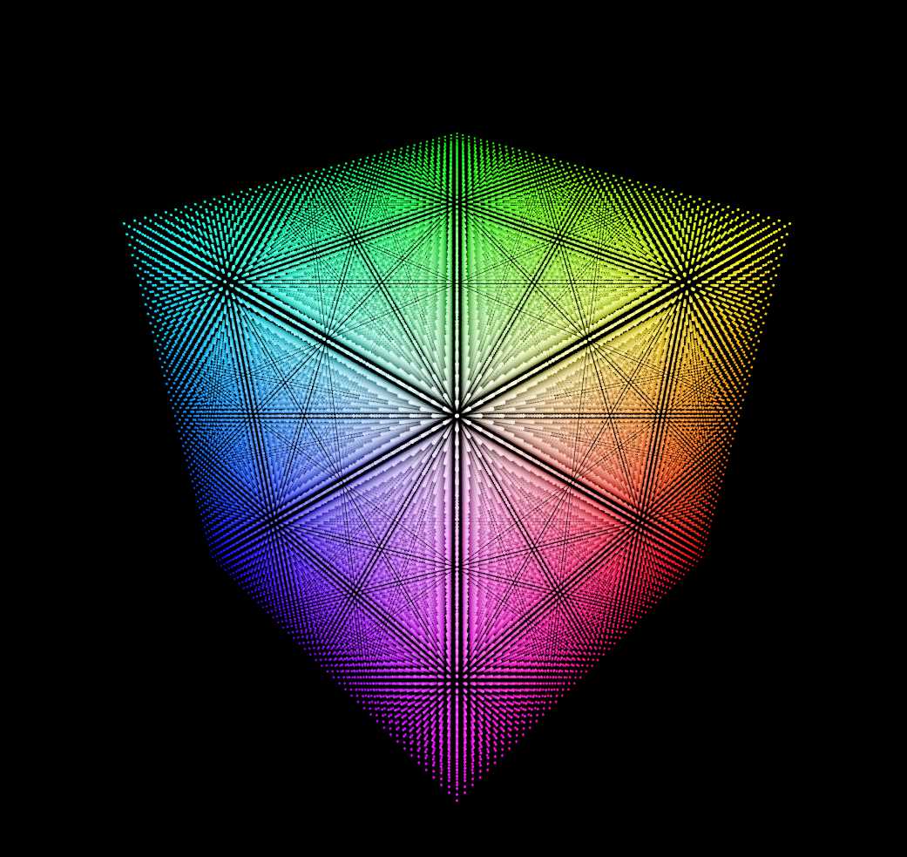
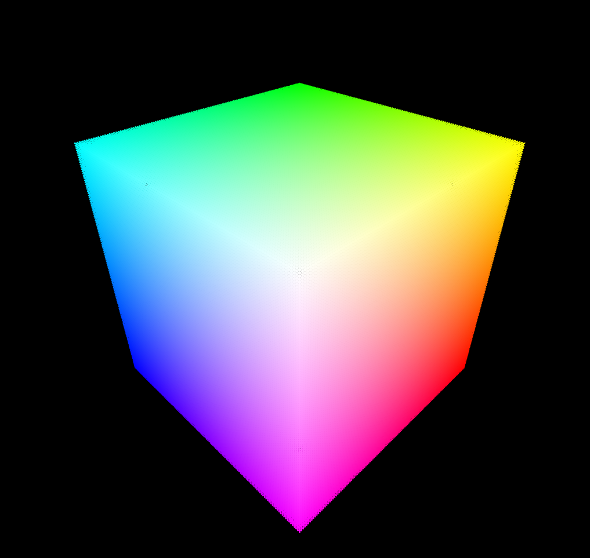

# RGB Cube

This is a simple RGB cube made with react-three-fiber.

> Live: https://rgb-cube.netlify.app



## Running the project

```bash
git clone https://github.com/ggzor/rgb-cube
cd rgb-cube

# If you use yarn
yarn install
yarn start

# If you use npm
npm install
npm start
```

## Higher density

**Beware** this could take a **long time to load** and be **very laggy** (or even unusable) on mobile devices.



- Denser: https://denser--rgb-cube.netlify.app/
- Denser x2: https://denser2--rgb-cube.netlify.app/
- Densest: https://densest--rgb-cube.netlify.app/

